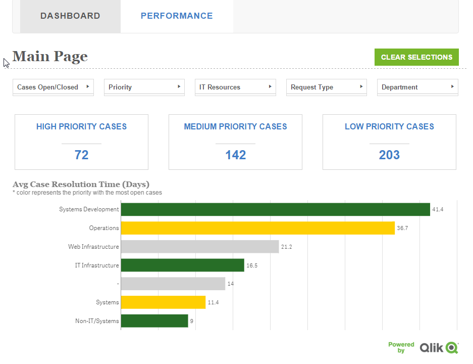

# Angular Template for Qlik Sense Capabilities API
A simple template to create a website with Angular js. It utilizes the Capabilities API for seamless interaction and multipage mashups

## Installation
- Place project under your extensions folder C:\Users\<username>\Documents\Qlik\Sense\Extensions
- From the command line run `bower install`  to get all the libraries.
- Access it from [http://localhost:4848/extensions/angularTemplate/index.html](http://localhost:4848/extensions/angularTemplate/index.html)

## Usage

##### Changing app and server
- js/lib/app.js, change the configuration to much your server host url and the app id. Qlik Sense server is running on secure protocol so make sure to change the port to 443

##### Adding pages
1. In js/controllers, Copy, paste and rename your new controller
2. In views, copy, paste and rename your new view for your controller
3. Load your new pages and define the url routes in js/lib/main.js, 
  * L12, add the controller `'controller.yourPage': scriptsUrl + 'js/controllers/yourPage',`
  * L46, add the url routes 
	```		.when('/d3', { 
				templateUrl: scriptsUrl+"views/yourPage.html",
				controller: 'controller.yourPage' 
	```		} )
  * Finally, load them by adding the controller in L58 `'controller.controller.yourPage'`
  * You can access your new page by going to http://localhost:4848/extensions/angularTemplate/index.html#/yourPage

##### Adding Qlik Sense Objects
- Add in your html the code `<get-object qvid="'objectId'" id="'objectId'" height="400" interaction="false"></get-object>`. 
  * qvid: the object id as found at the dev-hub `http://localhost:4848/dev-hub/single-configurator`
  * height: the object desired height
  * interaction: false if you want to disable interactions in your object otherwise just omit, defaults to true

##### Adding Drop Down filter
- Add in your html the code `<drop-down data-dimension="'Cases Open/Closed'" data-title="'Cases Open/Closed'" data-id="'cases'" data-showselected="true"></drop-down>`
  * data-dimension: is the dimension to populate the drop down list from
  * data-title: is for the text that will be displayed in the button
  * data-id: a unique id/name that the app will use to change the contents like text, colors etc
  * data-showselected="true" : if you want the button text to change to the seleted text


## Tutorials

##### Tutorial on how to use it with 'Helpdesk Management.qvf':
- <a href="https://community.qlik.com/blogs/qlikviewdesignblog/2016/02/05/creating-a-website-with-angular-and-the-capabilities-api">Creating a website with Angular and the Capabilities API</a>

##### Article on Memory Management and error handling:
- <a href="https://community.qlik.com/blogs/qlikviewdesignblog/2016/02/16/angularjs-and-capabilities-api-memory-management-and-qv-collapsed-listbox-delegated-open-error">Angularjs and Capabilities API - Memory management and "qv-collapsed-listbox-delegated-open" error</a>

##### Capability APIs 2.2 and Angularjs, disabled selections fix
- <a href="https://community.qlik.com/blogs/qlikviewdesignblog/2016/04/01/capabilities-api-22-and-angularjs-disabled-selections-fix">Capability APIs 2.2 and Angularjs, disabled selections fix</a>

##### Added export to csv directive as workaround for the bug found in 2.1
- <a href="https://community.qlik.com/blogs/qlikviewdesignblog/2016/03/04/capabilities-api-error-on-exporting-data">Capabilities API error on exporting data</a>

##### D3 support for custom Charts
- <a href="https://community.qlik.com/blogs/qlikviewdesignblog/2016/04/18/angularjs-capabilities-api-and-d3">Angularjs, Capabilities API and D3</a>

##### getObject using a directive
- <a href="https://community.qlik.com/blogs/qlikviewdesignblog/2016/05/27/angularjs-capabilites-api-getobject-the-angular-way-using-directive3">Angularjs, Capabilites API - getObject the Angular way using directive</a>

##### Creating Drop Down Menus
- <a href="https://community.qlik.com/blogs/qlikviewdesignblog/2016/06/24/angularjs-capabilities-api-dropdown-directive">Angularjs & Capabilities API - DropDown Directive</a>


